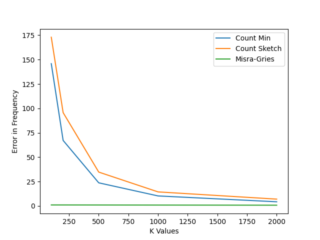
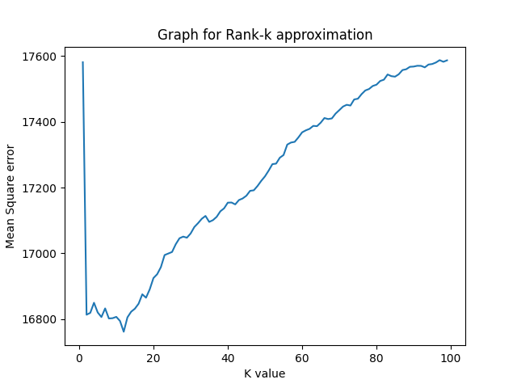

# Implementation of Data Science Algorithms (Sketch and SVD)

## Introduction: 
     
    > 'sketch_models.py'     contains code for all sketchs
    > 'question4.py'         contains code for ploting graph for all Sketchs
    > 'Rating_prediction.py' contains code for K-Rank approximation and plotting graph for the K-Rank with different k values
    >'Rating_CurveFit.py'    contains code for Rating prediction using Curve fitting with average rating of User and     Movie as coordinates.

1. **Error Graph of Count Min, Count Sketch and Misra-Gries**

    >

    > Here, I'm using 5 hash functions so, m=k/5 for Count min and Count Sketch

    > From the graph we can see that for k=2000 (approx) CM and CS has very low error. 
    
    > So for m=400 and d=5 CM and CS sketch has error less than 1%. 
    
    > For Misra-Gries for k=100 the error is less than 1%. 

    > Since we are testing with ID's with top 1000 frequencies the Misra Gries seems to work better compared to other sketchs. But if we had tested with all the ID's in random, then CM and CS sketch has an edge over Misra-Gries.
    

2. **Result of Movie Rating prediction using K-Rank approximation** 

    > The graph of K vs Error using Low rank Approximation is: 

    >

    > The error using a baseline Implementation(Curve fitting) is: 

        > The value of coefficients for curve fitting is: [0.36516845 0.64264228]
        > The error for Baseline model is: 1162.0094467790977

